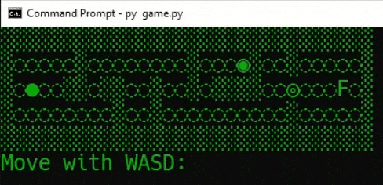

# Raspberry Pi Program

Building a quick, easy-to-use maze game and level creator in Python. Will add an additional file to play the game with LED lights on a breadboard instead of in the terminal.

## Running the maze game

- Clone the repository with `git clone github.com/cwrightlibrary/raspberry-pi-library.git`
- `cd raspberry-pi-library`
- Create a virtual environment with `python3 -m venv .venv`
- Update pip with `pip install --upgrade pip`
- Install the required libraries with `pip3 install -r requirements.txt`
- Run `level-maker.py` with `python3 level-maker.py` to create your own level map and press **[Save]** when done to export your map in text format to `level.txt`
- Run `game.py` to play the game in your terminal

## Preview

Below is an example of the `game.py` script running.

